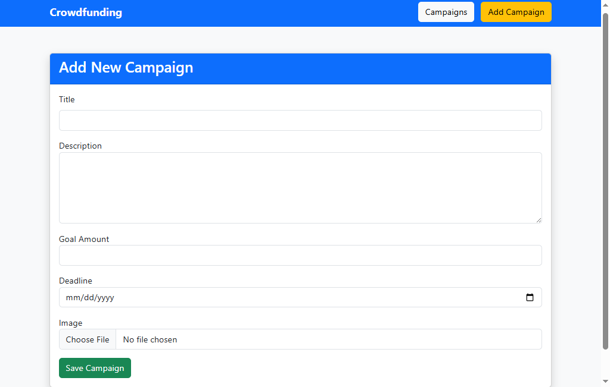
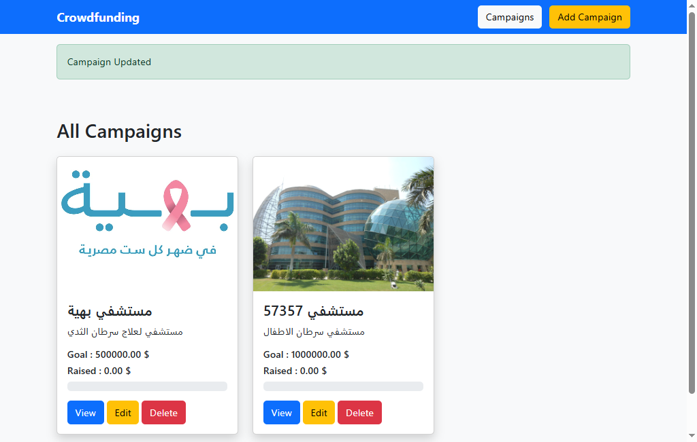
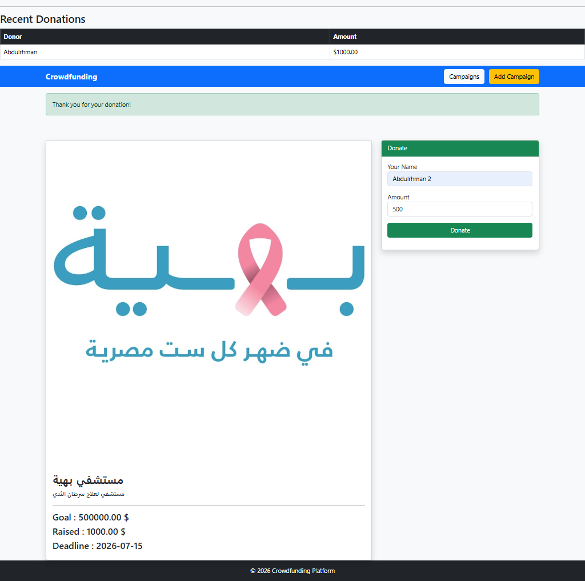
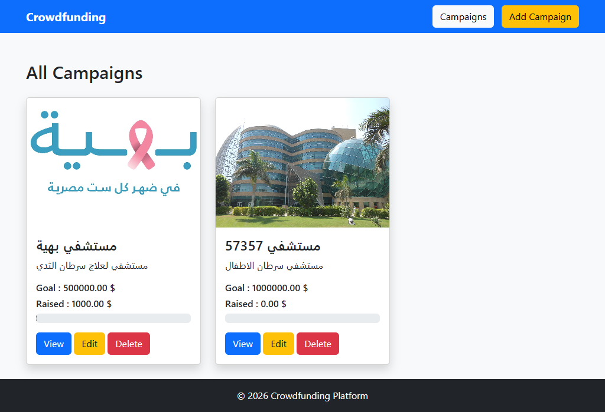

# 💰 Crowdfunding Platform

A simple and responsive crowdfunding platform built with **Laravel**. This project allows users to create fundraising campaigns, manage them, and receive donations through a clean Bootstrap interface.

---

## 🚀 Features

- Create a new campaign
- View all campaigns
- View campaign details
- Edit existing campaigns
- Delete campaigns
- Upload campaign images
- Make donations
- Automatically update the total raised amount
- Display donation history
- Progress bar showing fundraising percentage
- Responsive UI using Bootstrap

---

## 🛠️ Technologies Used

- Laravel 12
- PHP 8.2
- MySQL
- Bootstrap 5
- Blade Template Engine
- Eloquent ORM
- MVC Architecture

---

## 📂 Project Structure

```
app/
config/
database/
public/
resources/
routes/
storage/
```

---

## ⚙️ Installation

### Clone the repository

```bash
git clone https://github.com/abdulrahman-014/Crowdfunding-Platform-Laravel.git
```

### Open the project

```bash
cd Crowdfunding-Platform-Laravel
```

### Install dependencies

```bash
composer install
```

### Create environment file

```bash
cp .env.example .env
```

### Generate application key

```bash
php artisan key:generate
```

### Configure your database

Update the database settings inside the `.env` file.

### Run migrations

```bash
php artisan migrate
```

### Create storage link

```bash
php artisan storage:link
```

### Start the server

```bash
php artisan serve
```

Open:

```
http://127.0.0.1:8000
```

---

## 📸 Screenshots

### Home Page



### Create Campaign



### Campaign Details



### Donations


----------

## 📈 Future Improvements

- User Authentication
- User Dashboard
- Categories
- Search Campaigns
- Pagination
- Payment Gateway Integration
- Admin Dashboard
- Campaign Approval System

---

## 👨‍💻 Author

**Abdulrahman Ahmed**

GitHub:
https://github.com/abdulrahman-014

LinkedIn:
https://www.linkedin.com/in/abdul-rahman014

---

## 📄 License

This project is open-source and available for learning and educational purposes.
